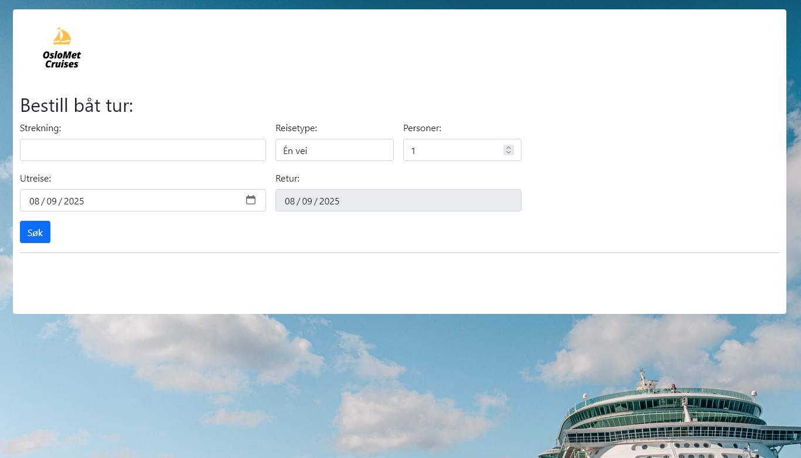

# Webapplikasjoner oppgave
Repo for oppgaven i emmet webapplikasjoner ITPE3200. Det skal implementeres en applikasjon for å bestille billetter til båtturer med f.eks Color Line eller Fjord Line. Denne repo inneholder både del 1 (`/Webapplication`) og del 2 (`/Webapplication-Admin`) av oppgaven.

## Mål for oppgaven
Lage en komplett løsning med mulighet for å foreta kjøp av billetter for oppgraderte sider for båtturer.
Løsningen skal lages i .NET Core.
Vise forståelse for NET Core, Javascript/JQuery og Entity Framework.

Løsningen bør blant annet inneholde:

Applikasjonen skal ha en forside hvor man kan velge hvilken strekning man ønsker og når man ønsker å reise.
Det skal bare være mulig å kjøpe billetter uten å måtte registrere seg som kunde. Dvs. at det ikke er nødvendig å lage innloggings-funksjonalitet. I oppgave 2 skal det lages en innlogging for å administrere løsningen.
Det skal ikke lages «backend» funksjonalitet som gjør det mulig å vedlikeholde, strekninger,  avganger og priser etc. Dette vil være en del av oppgave 2 og vil bli forventet implementert på en spesiell måte.

Ved evaluering av oppgaven vil det bla. bli vektlagt:

Design / layout
Funksjonalitet
Ryddig og forståelig kode (JavaScript og c#)
Database-struktur bruk av Entity Framework code first
Validering
Løsningen skal implementeres i ASP.Core med en Web-klient basert på JavaScript (Jquery). Det betyr at det ikke kreves avansert «single page application» funksjonalitet (vil kunne vises i oppgave 2).
Forsøk å gjøre nettsidene så brukervennlige som mulig. Det gir ingen ekstrapoeng å gjøre løsningen så lik som de eksiterende løsninger. Bra design vil også bli vektlagt. Dere kan ta bilder fra eksisterende løsninger uten å referere til disse.

## Løsningen

*Hovedside av løsningen*